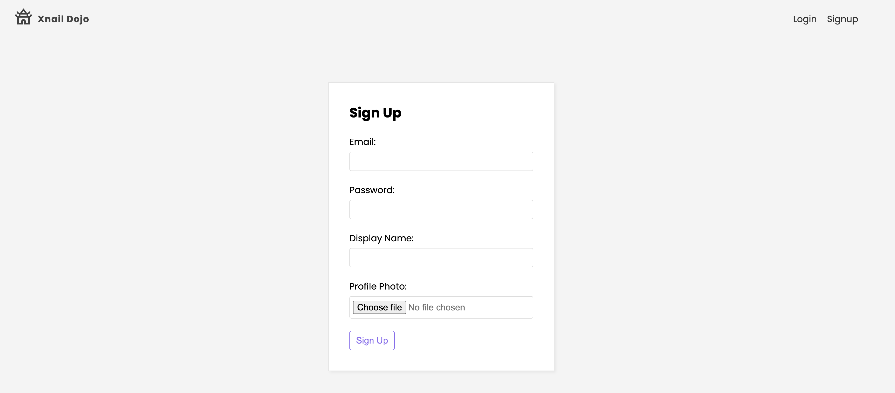

# React_The_Dojo

Repository created following this [Udemy Course](https://www.udemy.com/course/build-web-apps-with-react-firebase/) to practice the following React concepts:

- Custom Hooks
- Context
- Reducers
- Firebase Authentication
- Firebase Firestore
- Firebase Storage
- Firestore Rules
- Firebase Hosting

## Application

The application intends to be project manager for several users.Any user can sign up providing a profile picture and access the list of projects. Users can also create projects and share them with other users when creating it. Also, comments can be placed within the project so users can communicate through it.




## Run Locally

Clone the project

```bash
  git clone https://github.com/pedrolopezbiedma/React_The_Dojo.git
```

Install dependencies

```bash
  npm install
```

Set up Firebase connection.

- Create a firebase project.
- For the project, initialize a firestore database, authentication, storage & hosting
- Create a web app for the project.
- Grab the project config and set it up into the firebase folder within the local project

Start the application

```bash
  npm run start
```

## Authors

- [@pedrolopezbiedma](https://github.com/pedrolopezbiedma)
